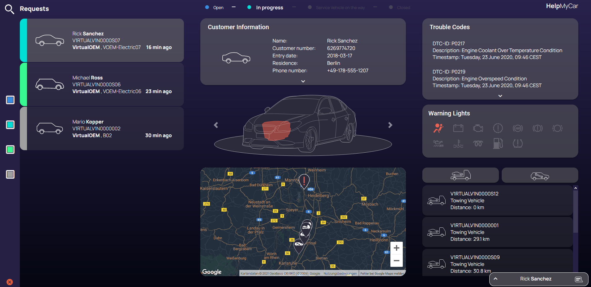
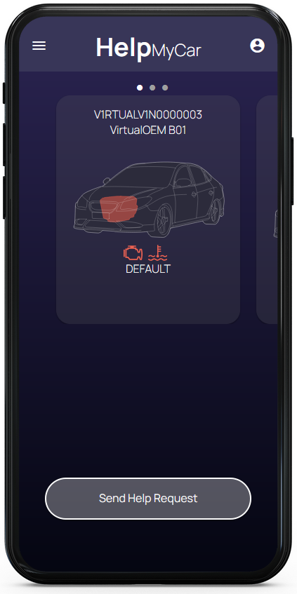

## HelpMyCar App

This is the repository of the SEP / IAD student project of team Greenbox Collective.
The goal of this project is to create a roadside assistance application that uses the Caruso API to gather vehicle information, 
which is used to support both the driver and the assistance operator.

 
The project consists of two frontend web-apps and a backend application:
- A driver app to request help in the case of a car failure.
- A dashbord app where an assistant operator can see and respond to help requests.
- A backend application that acts as a REST-service for the frontend and sends http-requests to the Caruso-API to gather vehicle information.

  

   
&emsp; &emsp; &emsp; &emsp; &emsp; &emsp; &emsp; &emsp; &emsp; &emsp; &emsp; &emsp;

&emsp; &emsp; &emsp; &emsp; &emsp; &emsp; &emsp; &emsp; &emsp; &emsp; &emsp; &emsp;

## Team

**Developers:**
- Anastasia Tataridou
- Simon Schneider
- Marvin Karhan
- Martin Wagner
- Maximilian Broszio

**Designers:**
- Frauke Stefanski
- Selina Mondrowski
- Sarah Willig
- Anna Winkenbach

**Contact:**
greenbox-collective@gmx.de 

## Technologies:
**Frontend:**
- HTML/CSS/JS
- Angular Framework
- StompJS and SockJS for WebSockets

 

**Backend:**
- Java
- Spring Boot
- Maven
